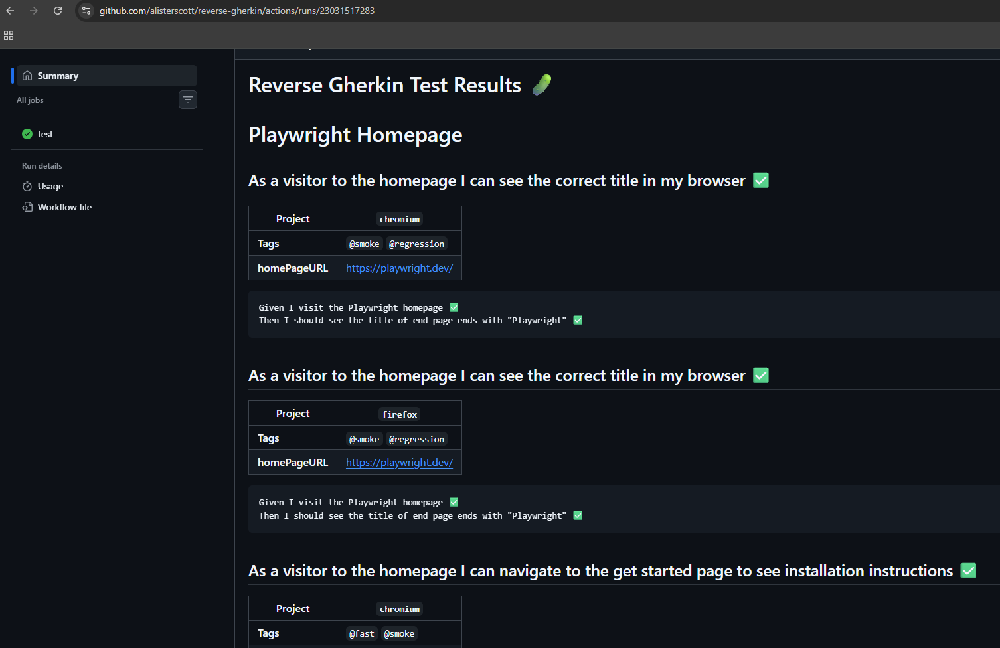

# Reverse Gherkin

**Reverse Gherkin**: write your Playwright specs as code and get plain language business readable specs on GitHub when you run them.

You know the old premise:

- Step One: collaborate with your business areas to write a bunch of test specifications as User Stories and Given/When/Then (Gherkin) format.
- Step Two: Spend a bunch of time mapping these Gherkin statements to reusable blocks of code using (sometimes complex) regexen.
- Step Three: Provide these reports to your business that show what happened when you ran these tests against your system under test.

What I've found in reality is step one rarely if ever happens, business areas often don't think in User Stories and Gherkin and probably won't think in a reusable steps way.

Step two is lot of effort and it makes tests harder to write and debug.

But I've found step three to be useful: providing test reports as plain language business readable specs. Business may not think in User Stories and Gherkin but they can read and understand them.

All you do is make sure you write your Playwright tests in a consistent manner.

Instead of this:

```typescript
import { test, expect } from '@playwright/test';

test('has title', async ({ page }) => {
  await page.goto('https://playwright.dev/');

  // Expect a title "to contain" a substring.
  await expect(page).toHaveTitle(/Playwright/);
});

test('get started link', async ({ page }) => {
  await page.goto('https://playwright.dev/');

  // Click the get started link.
  await page.getByRole('link', { name: 'Get started' }).click();

  // Expects page to have a heading with the name of Installation.
  await expect(
    page.getByRole('heading', { name: 'Installation' })
  ).toBeVisible();
});
```

you can write this:

```typescript
import { test, expect } from '@playwright/test';

test.describe('Playwright Homepage', () => {
  const homePageURL = 'https://playwright.dev/';

  test(
    'As a visitor to the homepage I can see the correct title in my browser',
    {
      tag: ['@smoke', '@regression'],
      annotation: { type: 'homePageURL', description: homePageURL },
    },
    async ({ page }) => {
      await test.step('Given I visit the Playwright homepage', async () => {
        await page.goto(homePageURL);
      });

      await test.step('Then I should see the title of end page ends with "Playwright"', async () => {
        await expect(page).toHaveTitle(/Playwright$/);
      });
    }
  );

  test(
    'As a visitor to the homepage I can navigate to the get started page to see installation instructions @fast',
    {
      tag: '@smoke',
      annotation: { type: 'homePageURL', description: homePageURL },
    },
    async ({ page }) => {
      await test.step('Given I visit the Playwright homepage', async () => {
        await page.goto(homePageURL);
      });

      await test.step('When I click the get started link', async () => {
        await page.getByRole('link', { name: 'Get started' }).click();
      });

      await test.step('Then I should see the "Installation" heading', async () => {
        await expect(
          page.getByRole('heading', { name: 'Installation', exact: true })
        ).toBeVisible();
      });
    }
  );
});
```

- Features become `test.describe`
- User Stories become `test`
- Gherkin becomes `test.step`

and when you run this it's super easy to generate this markdown:

## Reverse Gherkin Test Results 🥒

### Playwright Homepage

#### As a visitor to the homepage I can see the correct title in my browser ✅ `chromium`

```text
Given I visit the Playwright homepage ✅
Then I should see the title of end page ends with "Playwright" ✅
```

#### As a visitor to the homepage I can navigate to the get started page to see installation instructions ✅ `chromium`

```text
Given I visit the Playwright homepage ✅
When I click the get started link ✅
Then I should see the "Installation" heading ✅
```

This is done by a [custom reporter](/blob/main/reverse-gherkin-reporter.ts) with an option to include the annotations or not:

```
reporter: [
    ['list', { printSteps: true }],
    ['html'],
    [
      './reverse-gherkin-reporter.ts',
      {
        outputFile: 'test-results/reverse-gherkin.md',
        includeAnnotations: true,
      },
    ],
],
```

which generates a report with tags/annotations:

## Reverse Gherkin Test Results 🥒

### Playwright Homepage

#### As a visitor to the homepage I can see the correct title in my browser ✅

| Project         | `chromium`              |
| --------------- | ----------------------- |
| **Tags**        | `@smoke` `@regression`  |
| **homePageURL** | https://playwright.dev/ |

```text
Given I visit the Playwright homepage ✅
Then I should see the title of end page ends with "Playwright" ✅
```

#### As a visitor to the homepage I can navigate to the get started page to see installation instructions ✅

| Project         | `chromium`              |
| --------------- | ----------------------- |
| **Tags**        | `@fast` `@smoke`        |
| **homePageURL** | https://playwright.dev/ |

```text
Given I visit the Playwright homepage ✅
When I click the get started link ✅
Then I should see the "Installation" heading ✅
```

Once the Markdown is generated it's easy to capture this and post it to a GitHub Actions summary so you can automatically view it against a pull request or any GitHub Actions run:

```
- name: Append Reverse Gherkin Markdown Report to GitHub Summary
  if: ${{ !cancelled() }}
    run: |
    if [ -f test-results/reverse-gherkin.md ]; then
        echo "Appending Reverse Gherkin report to GitHub Summary..."
        cat test-results/reverse-gherkin.md >> $GITHUB_STEP_SUMMARY
    else
        echo "⚠️ No Reverse Gherkin report found at test-results/reverse-gherkin.md" >> $GITHUB_STEP_SUMMARY
    fi
```


